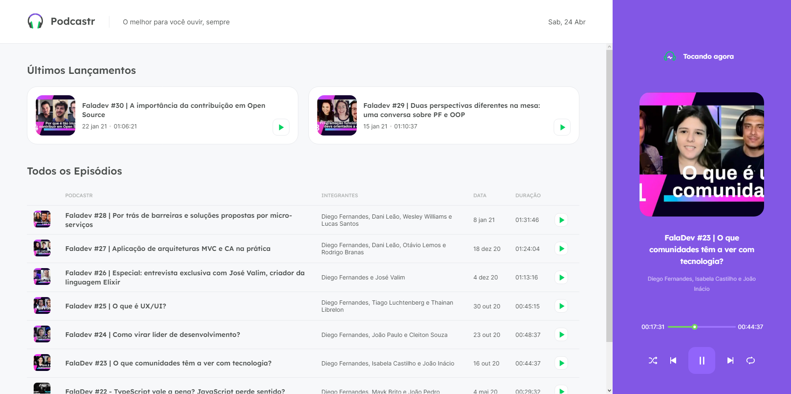
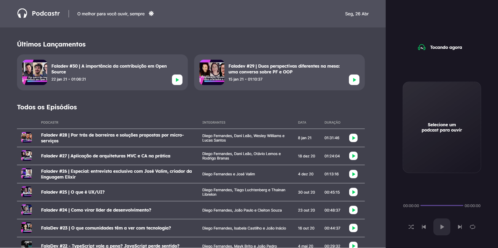
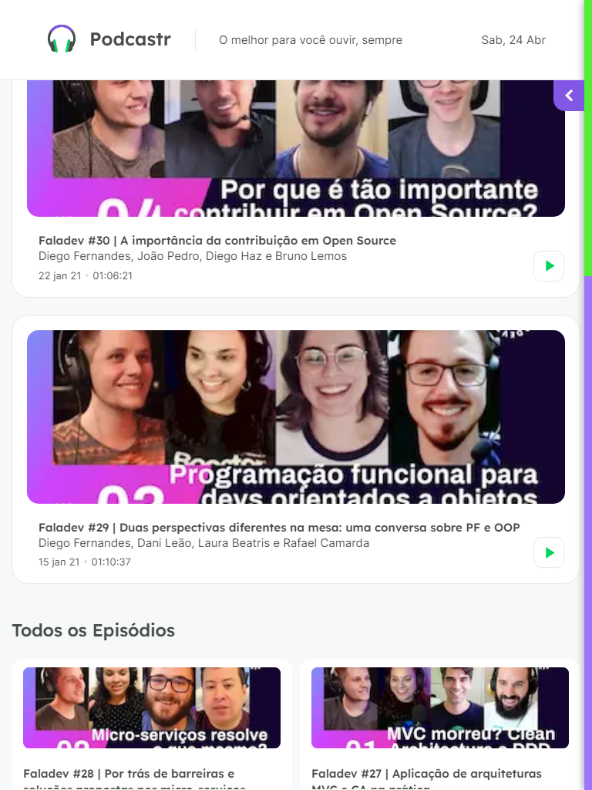
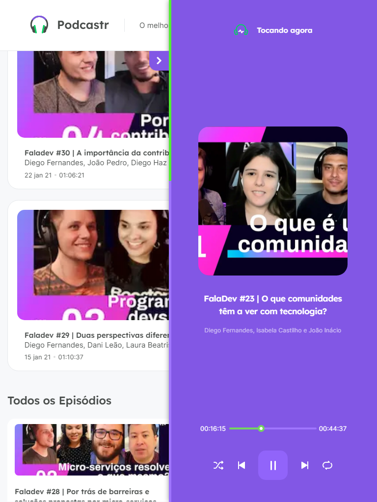
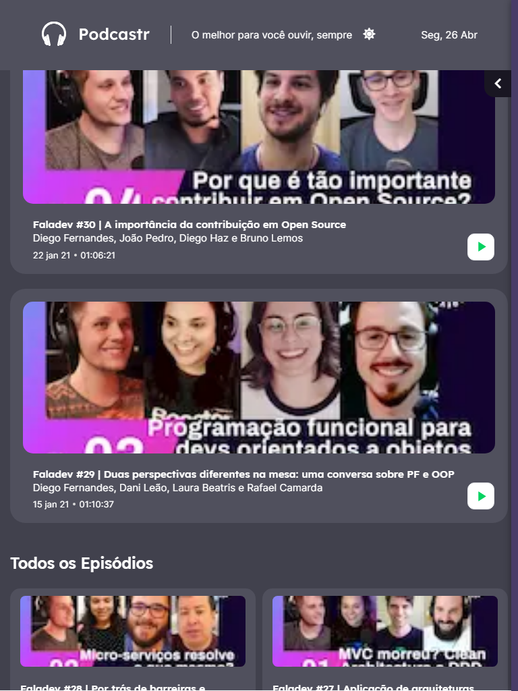
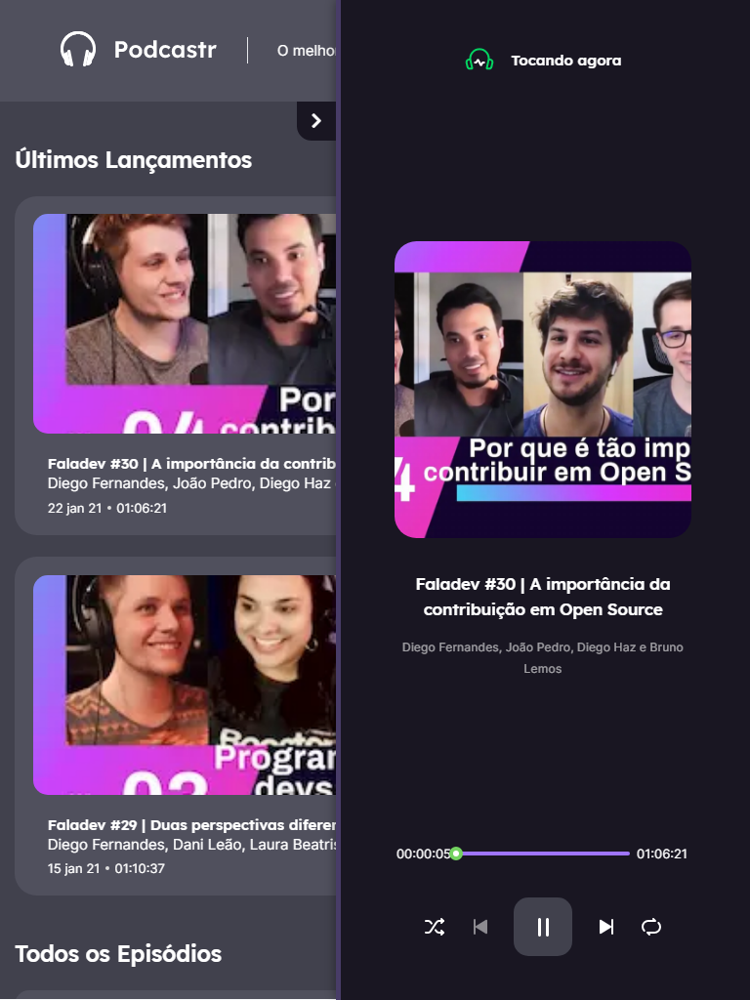
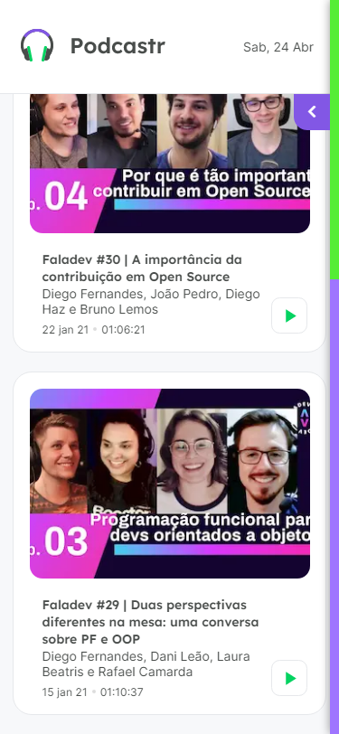

    

# NLW 5

Instrutor: Diego Fernandes - Rocketseat
Projeto: [Layout](https://www.figma.com/file/UwFEntsHpHYJlHNQAQr4gA/Podcastr?node-id=160%3A2761)

## Tela

    
    

 

## Disponsitivos tablet

    
    
    
    

 

## Disponsitivos móveis

    
    
    
    

 

## Tecnologias
- Next.js
- Json-server
- Typescript
- Scss
